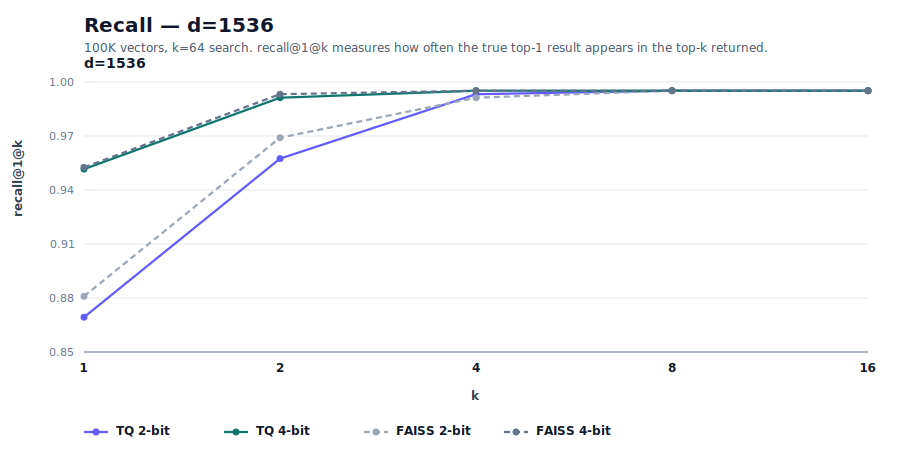
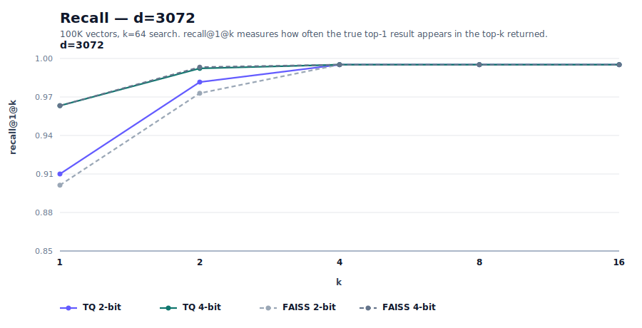
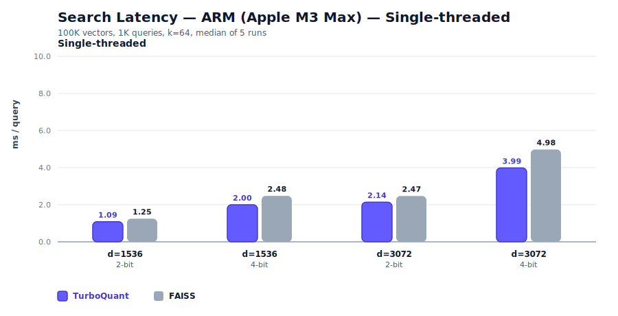
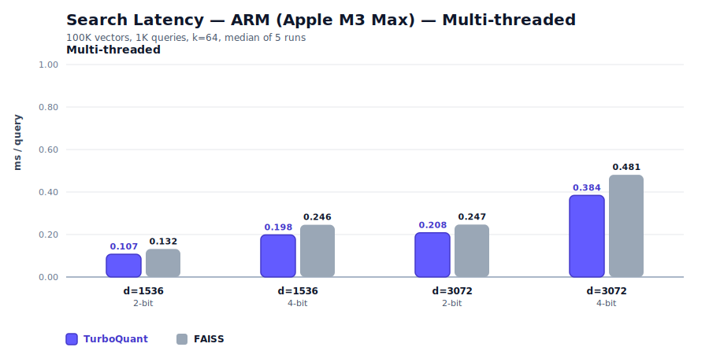
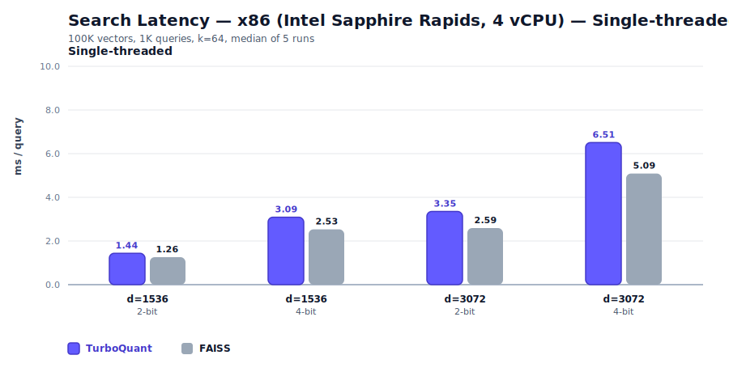
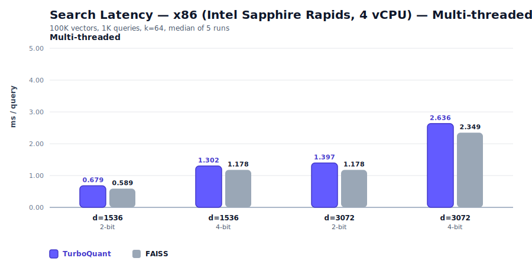

<p align="center">
  
</p>

<p align="center">
  <a href="https://github.com/RyanCodrai/turbovec/blob/main/LICENSE"></a>
  <a href="https://pypi.org/project/turbovec/"></a>
  <a href="https://crates.io/crates/turbovec"></a>
  <a href="https://arxiv.org/abs/2504.19874"></a>
</p>

---

**A 10 million document corpus takes 31 GB of RAM as float32. turbovec fits it in 4 GB - and searches it faster than FAISS.**

turbovec is a Rust vector index with Python bindings, built on Google Research's [**TurboQuant**](https://arxiv.org/abs/2504.19874) algorithm - a data-oblivious quantizer that matches the Shannon lower bound on distortion with zero training and zero data passes.

- **No codebook training.** Add vectors, they're indexed. No data-dependent calibration, no rebuilds as the corpus grows.
- **Faster than FAISS.** Hand-written NEON (ARM) and AVX-512BW (x86) kernels beat FAISS IndexPQFastScan by 12–20% on ARM and match-or-beat it on x86.
- **Pure local.** No managed service, no data leaving your machine or VPC. Pair with any open-source embedding model for a fully air-gapped RAG stack.

Building RAG where privacy, memory, or latency matters? **You're in the right place.**

## Python

```bash
pip install turbovec
```

```python
from turbovec import TurboQuantIndex

index = TurboQuantIndex(dim=1536, bit_width=4)
index.add(vectors)
index.add(more_vectors)

scores, indices = index.search(query, k=10)

index.write("my_index.tq")
loaded = TurboQuantIndex.load("my_index.tq")
```

### LangChain

```bash
pip install turbovec[langchain]
```

```python
from langchain_huggingface import HuggingFaceEmbeddings
from turbovec.langchain import TurboQuantVectorStore

embeddings = HuggingFaceEmbeddings(model_name="BAAI/bge-base-en-v1.5")

store = TurboQuantVectorStore.from_texts(
    texts=["Document 1...", "Document 2...", "Document 3..."],
    embedding=embeddings,
    bit_width=4,
)

retriever = store.as_retriever(search_kwargs={"k": 5})
```

### LlamaIndex

```bash
pip install turbovec[llama-index]
```

```python
from llama_index.core import VectorStoreIndex, StorageContext
from turbovec.llama_index import TurboQuantVectorStore

vector_store = TurboQuantVectorStore.from_params(dim=768, bit_width=4)
storage_context = StorageContext.from_defaults(vector_store=vector_store)

index = VectorStoreIndex.from_documents(documents, storage_context=storage_context)
retriever = index.as_retriever(similarity_top_k=5)
```

### Haystack

```bash
pip install turbovec[haystack]
```

```python
from haystack import Document
from turbovec.haystack import TurboQuantDocumentStore

store = TurboQuantDocumentStore(dim=768, bit_width=4)
store.write_documents([
    Document(content="...", embedding=[...], meta={"source": "a"}),
])

results = store.embedding_retrieval(query_embedding=[...], top_k=5)
store.delete_documents(["some-id"])  # O(1) delete supported
```

## Rust

```bash
cargo add turbovec
```

```rust
use turbovec::TurboQuantIndex;

let mut index = TurboQuantIndex::new(1536, 4);
index.add(&vectors);
let results = index.search(&queries, 10);
index.write("index.tv").unwrap();
let loaded = TurboQuantIndex::load("index.tv").unwrap();
```

## Recall

TurboQuant vs FAISS `IndexPQ` (LUT256, nbits=8) — the paper's Section 4.4 baseline. 100K vectors, k=64. FAISS PQ sub-quantizer counts sized to match TurboQuant's bit rate (m=d/4 at 2-bit, m=d/2 at 4-bit).






Across OpenAI d=1536 and d=3072, TurboQuant and FAISS are within 0–1 point at R@1 and both converge to 1.0 by k=4–8. GloVe d=200 is a harder regime — at low dim the asymptotic Beta assumption is looser, and our TurboQuant trails FAISS by 3–6 points at R@1 there, closing by k≈16–32.

**A note on baselines.** We compare against FAISS `IndexPQ` (LUT256, nbits=8, float32 LUT) because it's the default production-grade PQ most users would reach for. This is a stronger baseline than the custom u8-LUT PQ in the [TurboQuant paper](https://arxiv.org/abs/2504.19874) — FAISS uses a higher-precision LUT at scoring time and k-means++ for codebook training. We reproduce the paper's TurboQuant numbers on OpenAI d=1536 / d=3072 and hit similar numbers to other community reference implementations on low-dim embeddings (see [`turboquant-py`](https://pypi.org/project/turboquant-py/) at d=384). The visible gap on GloVe reflects FAISS being a strong baseline, not a TurboQuant implementation issue.

Full results: [d=1536 2-bit](benchmarks/results/recall_d1536_2bit.json), [d=1536 4-bit](benchmarks/results/recall_d1536_4bit.json), [d=3072 2-bit](benchmarks/results/recall_d3072_2bit.json), [d=3072 4-bit](benchmarks/results/recall_d3072_4bit.json), [GloVe 2-bit](benchmarks/results/recall_glove_2bit.json), [GloVe 4-bit](benchmarks/results/recall_glove_4bit.json).

## Compression


## Search Speed

All benchmarks: 100K vectors, 1K queries, k=64, median of 5 runs.

### ARM (Apple M3 Max)





On ARM, TurboQuant beats FAISS FastScan by 12–20% across every config.

### x86 (Intel Xeon Platinum 8481C / Sapphire Rapids, 8 vCPUs)





On x86, TurboQuant wins every 4-bit config by 1–6% and runs within ~1% of FAISS on 2-bit ST. The 2-bit MT rows (d=1536 and d=3072) are the only configs sitting slightly behind FAISS (2–4%), where the inner accumulate loop is too short for unrolling amortization to match FAISS's AVX-512 VBMI path.

## How it works

Each vector is a direction on a high-dimensional hypersphere. TurboQuant compresses these directions using a simple insight: after applying a random rotation, every coordinate follows a known distribution -- regardless of the input data.

**1. Normalize.** Strip the length (norm) from each vector and store it as a single float. Now every vector is a unit direction on the hypersphere.

**2. Random rotation.** Multiply all vectors by the same random orthogonal matrix. After rotation, each coordinate independently follows a Beta distribution that converges to Gaussian N(0, 1/d) in high dimensions. This holds for any input data -- the rotation makes the coordinate distribution predictable.

**3. Lloyd-Max scalar quantization.** Since the distribution is known, we can precompute the optimal way to bucket each coordinate. For 2-bit, that's 4 buckets; for 4-bit, 16 buckets. The [Lloyd-Max algorithm](https://en.wikipedia.org/wiki/Lloyd%27s_algorithm) finds bucket boundaries and centroids that minimize mean squared error. These are computed once from the math, not from the data.

**4. Bit-pack.** Each coordinate is now a small integer (0-3 for 2-bit, 0-15 for 4-bit). Pack these tightly into bytes. A 1536-dim vector goes from 6,144 bytes (FP32) to 384 bytes (2-bit). That's 16x compression.

**Search.** Instead of decompressing every database vector, we rotate the query once into the same domain and score directly against the codebook values. The scoring kernel uses SIMD intrinsics (NEON on ARM, AVX-512BW on modern x86 with an AVX2 fallback) with nibble-split lookup tables for maximum throughput.

The paper proves this achieves distortion within a factor of 2.7x of the information-theoretic lower bound (Shannon's distortion-rate limit). You cannot do much better for a given number of bits.

## Building

### Python (via maturin)

```bash
pip install maturin
cd turbovec-python
maturin build --release
pip install target/wheels/*.whl
```

### Rust

```bash
cargo build --release
```

All x86_64 builds target `x86-64-v3` (AVX2 baseline, Haswell 2013+) via `.cargo/config.toml`. Any CPU that can run the AVX2 fallback kernel can run the whole crate — the AVX-512 kernel is gated at runtime via `is_x86_feature_detected!` and only kicks in on hardware that supports it.

## Running benchmarks

Download datasets:
```bash
python3 benchmarks/download_data.py all            # all datasets
python3 benchmarks/download_data.py glove          # GloVe d=200
python3 benchmarks/download_data.py openai-1536    # OpenAI DBpedia d=1536
python3 benchmarks/download_data.py openai-3072    # OpenAI DBpedia d=3072
```

Each benchmark is a self-contained script in `benchmarks/suite/`. Run any one individually:
```bash
python3 benchmarks/suite/speed_d1536_2bit_arm_mt.py
python3 benchmarks/suite/recall_d1536_2bit.py
python3 benchmarks/suite/compression.py
```

Run all benchmarks for a category:
```bash
for f in benchmarks/suite/speed_*arm*.py; do python3 "$f"; done    # all ARM speed
for f in benchmarks/suite/speed_*x86*.py; do python3 "$f"; done    # all x86 speed
for f in benchmarks/suite/recall_*.py; do python3 "$f"; done       # all recall
python3 benchmarks/suite/compression.py                            # compression
```

Results are saved as JSON to `benchmarks/results/`. Regenerate charts:
```bash
python3 benchmarks/create_diagrams.py
```

## References

- [TurboQuant: Online Vector Quantization with Near-optimal Distortion Rate](https://arxiv.org/abs/2504.19874) (ICLR 2026) -- the paper this implements
- [FAISS Fast accumulation of PQ and AQ codes](https://github.com/facebookresearch/faiss/wiki/Fast-accumulation-of-PQ-and-AQ-codes-(FastScan)) -- turbovec's x86 SIMD kernel adapts FastScan's pack layout, nibble-LUT scoring, and u16 accumulator strategy
